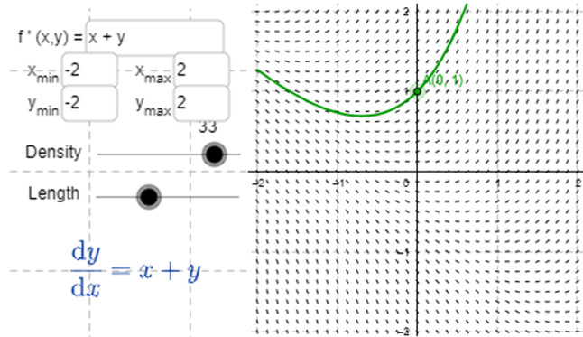

Una ecuación diferencial es una ecuación que contiene una función desconocida y una o más de sus derivadas.

El orden de la ecuación diferencial es el de la mayor de las derivadas que aparecen en la ecuación.

### Ejemplo:

$y' = xy \rightarrow y$ es una función desconocida de $x$

Una ecuación $f$ es la solución de una ecuación diferencial si $y = f(x)$ y sus derivadas se pueden sustituir en la ecuación diferencial.

$$f'(x) = xf(x)$$

#### Actividad 1

Demuestra que cualquier miembro de la familia de funciones $$y = \frac{1+ce^t}{1-ce^t}$$ 
Es solución de la ecuación diferencial $$y' = \frac{1}{2}(y^2-1)$$

> **Solución**

$$y' = \frac{(1-ce^t)(ce^t)+(ce^t)(1+ce^t)}{(1-ce^t)^2} = \frac{ce^t - c^2e^{2t}+ce^t+c^2e^{2t}}{(1-ce^t)^2} = \frac{2ce^t}{(1-ce^t)^2}$$

$$y' = \frac{1}{2}(\frac{(1+ce^t)^2}{(1-ce^t)^2}-1) = \frac{1}{2}(\frac{1+2ce^t+c^2e^{2t}}{(1-ce^t)^2}-\frac{1-2ce^t+c^2e^{2t}}{1-ce^t)^2}) = \frac{1}{2}(\frac{4ce^t}{(1-ce^t)^2}) = \frac{2ce^t}{(1-ce^t)^2}$$

# Problemas con valores iniciales

Al resolver un problema de ecuaciones diferenciales con una conidición inicial buscamos aquella solución que satisface una cierta condición [Valor inicial]

$$t_{0} = 0$$
$$y(0) = 2$$ 
$$(0,2)$$

$$2 = \frac{1+ce^0}{1-ce^0} = \frac{1+c}{1-c}$$

> Supongamos $c\ne 1$

$$2(1-c)=1+c$$

$$2-2c=1+c$$

$$1=3c$$

$$\frac{1}{3} = c$$

# Campos direccionales y Método de Euler

$$y' = x+y$$

> Condición inicial $t_{0} \rightarrow y(t_{0}) = 1$

$y'$ es la pendiente de la curva, $\therefore y' = 0 + 1 \Rightarrow y' = 1$


$$\begin{array}{|c|c|c|c|c|c|}
\hline
x & -2   & -1 & 0 & 1 & 1    \\ 
\hline
y & -2   & -1 & 0 & 1 & 2 \\ 
\hline    
y' & -4  & -2 & 0 & 1 & 2 \\
\hline
\end{array}$$




Por lo tanto, aunque no tengamos la forma funcional podemos bosquejar la solución que pasa por el punto $(0,1)$ [Condición inicial].

> **ATENCIÓN:** Dibujar la curva para que sea paralela a los segmentos de recta cercana.

Por lo tanto, cuando una ecuación diferencial diferencial de $1^{er}$ orden y es de la forma $y = F(x,y)$ la ecuación diferencial nos dice que la pendiente de una curva solución en el punto $(x,y)$ sobre la curva $F(x,y)$.

Dibujando segmentos cortos de la recta con pendiente $y'$ en varios puntos el resultado que obtenemos se llama campo direccional o campo de pendientes o campo de fuerza.

Estos segmentos de recta nos indican la dirección en que apunta una curva solución, así que el campo direccional nos ayuda a ver la forma general de estas curvas. 

## Método de Euler

Retoma los campos direccionales para hayar una aproximación numérica de soluciones. Constituye las restas en cada paso.

Por lo tanto $t_{0}(0) \Rightarrow y(t_{0}) = 1$

$y' = y + x$

$y' = 0 + 1 \Rightarrow y' = 1$

$$L(x) = x+1$$

Podemos usar la recta tangente como aproximación para la curva, Euler quiere mejorar esta aproximación prosiguiendo sólo una corta distancia distancia a lo largo de la recta tangente y luego hacer una correción a la mitad de curso cambiando la dirección así como lo indica el campo direccional.

En lugar de $(0,1)$, $(0,5)$ obtenemos la derivada primera $y'$ por lo tanto es más inclinada.

$$y'(0,5) = 2 \Rightarrow L(x) = 2x + \frac{1}{2}  ~Aproximación$$

Así, aumentando el paso tendríamos la aproximación más quebrada (más rectas).

En general el método de Euler propone comenzar en el punto dado por el valor inicial y avanzar en la dirección indicada por el campo direccional, se detiene después de un corto tiempo, examina y avanza siguiendo la dirección.

Euler no produce una solución exacta sino que nos arroja una aproximación, al disminuirse el tamaño del paso aumentamos las iteraciones (correciones) y obtenemos aproximaciones mejores.

Entonces $y' = F(x,y)$ con $y(x_{0}) = y_{0}$

Encontrar los valores aproximados:

$$x_{0}$$
$$x_{1} = x_{0} + h$$
$$x_{2} = x_{1} + h$$
$$\vdots$$
La ecuación diferencial nos dice que la pendiente $(x_{0}, y_{0})$
$$\Rightarrow y' = F(x_{0}, y_{0})$$
$$y_{1} = y_{0} + hF(x_{0}, y_{0})$$
$$y_{2} = y_{1} + h_{1}F(x_{1}, y_{1})$$
$$\vdots$$
$$y_{n} = y_{n-1} + h_{n-1}F(x_{n-1}, y_{n-1}) \rightarrow Forma\ aproximada\ del\ método\ de\ Euler$$   

#### Ejercicio

$$y' = x + h\\ y_{0} = 1\\ h = 0.1 ,\ x_{0} = 0,\ y_{0} = 1,\ f(x,y) = x+y$$
$$\left.\begin{array}{l} 
y_{1} = y_{0} + hF(x_{0}, y_{0}) = 1 + 0.1(1+0) = 1.1\\
y_{2} = y_{1} + hF(x_{1}, y_{1}) = 1.1 + 0.1(0.1 + 1.1) = 1.22\\
y_{3} = y_{2} + hF(x_{2}, y_{2}) = 1.2 + 0.1(0.2 + 1.2) = 1.362
\end{array}\right.$$
Eso significa que el valor $y(0.3) = 1.362$

# Ecuaciones separables

Es una ecuación diferencial de $1^{er}$ orden en que la expresión de $dy$ con respecto a $dx$ se puede factorizar como una función de $y$.

El nombre de ecuaciones diferenciables separables se refiere a que la expresión del lado derecho se puede separar en función de $x$ y en función de $y$.
$$\frac{dy}{dx} = g(x) \cdot f(y),  \ si f(y) \ne 0$$ 
$$\Rightarrow \frac{dy}{dx} = \frac{g(x)}{h(y)}, \ donde \ h(y) = \frac{1}{f(y)}$$
$$\Rightarrow h(y) dy = g(x) dx$$
$$\therefore \int h(y)dy = \int g(x)dx$$
$$\Rightarrow \frac{d}{dx}(\int h(y)dy) = \frac{d}{dx}(\int g(x)dx)$$
$$\Rightarrow \frac{d}{dy} (\int h(y)dy) \frac{dy}{dx}= g(x)$$
$$\Rightarrow h(y) \frac{dy}{dx} = g(x)$$

#### Ejemplo:

Resuelve la ecuación y encuentra la solución para $t_{0} = 0, \ y(t_{0}) = 2$

$$\frac{dy}{dx} = \frac{x^2}{y^2}$$
$$\Rightarrow y^2dy = x^2dx$$
$$\Rightarrow \int y^2dy = \int x^2dx$$
$$\Rightarrow y^3 = x^3 + C$$
$$\therefore y = \sqrt[3]{x^3 + C} \rightarrow Solución\ Explícita$$

Si $(0,2)$ $$\Rightarrow 2^3 = 0^3 + C$$
$$\Rightarrow 2^3 = C$$
$$\Rightarrow C = 8$$
$$\therefore La\ ecuación\ solución\ es\ y = \sqrt[3]{x^3 + 8}$$

#### Ejemplo

Encontrar la forma general de 
$$\frac{dy}{dx} = \frac{6x^2}{2y + \cos(y)}$$
$$\Rightarrow (2y + \cos(y))dy = 6x^2dx$$
$$\Rightarrow \int (2y + \cos(y))dy = \int 6x^2dx$$
$$\Rightarrow y^2 + \sin(y) = 2x^3 + C \rightarrow Solución\ Implícita$$

#### Ejemplo 

Obtener la solución de $\frac{dy}{dx} = x^2 y; y\ne 0$

$$\frac{dy}{dx} = x^2y$$
$$\Rightarrow \frac{1}{y}dy = x^2 dx$$
$$\Rightarrow \int \frac{1}{y} dy = \int x^2dx$$
$$\Rightarrow \ln|y| = \frac{1}{3}x^3 + C$$
$$|y| = e^{\frac{1}{3}x^3}\cdot e^c$$
$$y = \pm (e^{\frac{1}{3}x^3}\cdot e^c)$$
$\rightarrow$ A = $e^c$

$$\therefore y = \pm A\cdot e^{\frac{1}{3}x^3} \rightarrow Solución\ Explícita$$

# Trayectoria Ortogonal

Una trayectoria ortogonal de una familia de curvas es una curva que corta ortogonalmente cada curva de la familia.

$$x^2 + y^2 = r^2$$
$$y = kx$$
$$m\cdot m' = -1 \rightarrow Condición\ para\ que\ sean\ ortogonales$$
```{r, echo=FALSE}
plot(0, type = "l", xlim = c(-5,5), ylim = c(-5,5), xlab="x", ylab="y")
abline(v = 0, col = "black", lty = "solid")
abline(h = 0, col = "black", lty = "solid")
abline(0,0.5)
abline(0,-0.5)
abline(0,1)
abline(0,-1)
abline(0,1.5)
abline(0,-1.5)
abline(0,2.5)
abline(0,-2.5)
symbols(x=c(0,0,0), y=c(0,0,0), circles=c(1,2,3), add=T)
```

#### Ejemplo

Encuentra las trayectorias ortogonales de la familia de curvas $x = ky^2$ donde $k$ es constante

```{r, echo = FALSE}
plot(0, type = "l", xlim = c(-5,5), ylim = c(-5,5), xlab="x", ylab="y")
abline(v = 0, col = "black", lty = "solid")
abline(h = 0, col = "black", lty = "solid")
curve(sqrt(x), xlim = c(0,5), col = "black", lty = "solid", add = TRUE)
curve(2*sqrt(x), xlim = c(0,5), col = "black", lty = "solid", add = TRUE)
curve(3*sqrt(x), xlim = c(0,5), col = "black", lty = "solid", add = TRUE)
curve(-sqrt(x), xlim = c(0,5), col = "black", lty = "solid", add = TRUE)
curve(-2*sqrt(x), xlim = c(0,5), col = "black", lty = "solid", add = TRUE)
curve(-3*sqrt(x), xlim = c(0,5), col = "black", lty = "solid", add = TRUE)
curve(sqrt(-x), xlim = c(-5,0), col = "black", lty = "solid", add = TRUE)
curve(2*sqrt(-x), xlim = c(-5,0), col = "black", lty = "solid", add = TRUE)
curve(3*sqrt(-x), xlim = c(-5,0), col = "black", lty = "solid", add = TRUE)
curve(-sqrt(-x), xlim = c(-5,0), col = "black", lty = "solid", add = TRUE)
curve(-2*sqrt(-x), xlim = c(-5,0), col = "black", lty = "solid", add = TRUE)
curve(-3*sqrt(-x), xlim = c(-5,0), col = "black", lty = "solid", add = TRUE)
```

> Derivamos

$$\Rightarrow 1 = 2ky \frac{dy}{dx}$$
$$\Rightarrow \frac{dy}{dx} = \frac{1}{2ky}$$
$\rightarrow$ Como $k = \frac{x}{y^2}$

$$\Rightarrow \frac{dy}{dx} = \frac{1}{2\frac{x}{y}}$$
$$\Rightarrow \frac{dy}{dx} = \frac {y}{2x} \rightarrow Pendiente$$
$\therefore$ La familia de funciones ortogonales es $\frac{dy}{dx} = -\frac{2x}{y}$ 

$$\Rightarrow \int ydy = -\int 2xdx$$
$$\Rightarrow \frac{1}{2}y^2 = -x^2 + C$$
$$\therefore x^2 + \frac{1}{2}y^2 + C = 0 \rightarrow Las\ elipses\ son\ ortogonales\ a\ x = ky^2$$

# Problemas de mezclas

Un problema característico involucra un tanque de capacidad fija lleno con una solución mezclada en todas sus partes de alguna sustancia. Una solución de una determinada concentración entra al recipiente en una proporción fija y la mezcla totalmente agitada sale con una proporción fija que puede ser diferente a la proporción entrante.

Denotamos con $y(t)$ la cantidad de sustancia dentro del recipiente en el tiempo $t$.
Con $y'(t)$ indicamos la proporción de sustancia que está siendo añadida menos la proporción que está siendo removida.

#### Ejercicio

Tenemos un tanque que contiene 20kg. de sal disuelta en 5 mililitros de agua, se añade salmuera de 0.03 kg. de sal por litro a una razón de 25 litros por minuto. La sal se mantiene mezclada todo el tiempo y sale con la misma razón. ¿Cuánta sal queda en el recipiente después de media hora?

$$y(0) = 20, \ REntrada = 0.03\cdot 25 = 0.75, \ RSalida = \frac{y(t)}{5000}\cdot 25 = \frac{y(t)}{200}$$
$$y(t) = ?  ,\  t = 30$$
$$\frac{dy}{dt} = 0.75 - \frac{y(t)}{200}$$
$$\frac{dy}{dt} = \frac{150-y(t)}{200} \Rightarrow \int \frac{dy}{150-y} = \int \frac{dt}{200}$$
$$\Rightarrow -\ln|150-y| = \frac{1}{200}t + C$$
$\rightarrow$ Como $y(0) = 20$
$$C = -\ln(130)$$
$$\Rightarrow y(t) = 150 - 130e^{\frac{-t}{200}}$$
$$\Rightarrow y(30) = 150 - 130e^{-\frac{30}{200}}$$
$$\therefore y(30) = 38.1 kg.$$

#### Ejercicio

Hubo un homicidio y se quiere saber la hora de la muerte. La temperatura superficial de un objeto cambia con una razón proporcional a la diferencia entre la temperatura del objeto y la de su entorno, a esto se le llama Ley de Enfriamiento de Newton y por lo tanto podemos representar la temperatura como: $$\theta(t) \rightarrow Temperatura\ corporal$$
$$\boldsymbol{T} \rightarrow Temperatura\ ambiente$$

La ecuación diferencial es $\frac{d\theta}{dt} = -K(\theta - \boldsymbol{T})$

$$\theta_{0} = 37^o$$
$$t_{d} = Instante\ del\ deceso$$

Tenemos $\theta_{1} - \boldsymbol{T} = (\theta_{0} - \boldsymbol{T})e^{-kt_{1}}$

$$K = \frac{-1}{t_{1}} \ln(\frac{\theta_{1} - \boldsymbol{T}}{\theta_{0} - \boldsymbol{T}})$$
$$\theta_{d} = 29.4^o$$
$$\theta_{1} = 23.3^o \rightarrow 2\ hrs.\ después$$
$$\boldsymbol{T} = 20^o$$
$$\Rightarrow K = -\frac{1}{2} \ln(\frac{23.3-20}{37-20}) = 0.8196$$
$$t_{d} = -\frac{1}{0.8196} \ln(\frac{29.4 - 20}{37 - 20}) = 0.723$$

# Modelos de crecimiento poblacional

### Ley de crecimiento natural

El presupuesto es que la población crece con una tasa proporcional al tamaño de la población. $$\frac{dP}{dt} = KP$$
La función $P$ es una función respecto al tiempo e indica la cantidad de población al tiempo $t$ donde $K$ es constante.
$$Si\ K>0 \rightarrow \uparrow P$$
$$Si\ K<0 \rightarrow \downarrow P$$
$$\int \frac{dP}{P} = \int Kdt$$
$$\ln|P| = Kt + C$$
$$|P| = e^{Kt+C} = e^{Kt}\cdot e^C \Rightarrow P = Ae^{Kt};\ A=\pm e^C$$
$$e^c = A$$
$$P(0) = A \Rightarrow P(t) = P(0)e^{Kt}$$
La rapidez entre la población es constante.
$$\frac{1}{P} \frac{dP}{dt} = K$$
$$\frac{dP}{dt} = KP - m$$
> m es constante, representa la emigración (Personas que se van)

### Modelo logístico

$$\frac{dP}{dt} = KP(1-\frac{P}{M})$$
$$(1-\frac{P}{M}) \rightarrow Máxima\ población\ posible$$
Si la población $0<P<m$ la variación será positiva, entonces la población crece.

Si $P>m \Rightarrow 1-\frac{P}{m} < 0$ la población decrece.

####  Variaciones del modelo logístico

$$\frac{dP}{dt} = KP(1-\frac{P}{M}) - C$$
$$\frac{dP}{dt} = KP(1-\frac{P}{M})(1-\frac{m}{P})$$

##### Modelo de Gompertz 

$$\frac{dP}{dt} = C\ln(\frac{m}{P})P$$

##### Crecimiento estacional

Depende de las estaciones
$$\frac{dP}{dt} = KP\cos(rt - \Phi); \ K,r,\Phi\ constantes\ge 0$$

#### Ejercicio

Considere la ecuación logística
$$K_{0}=0.08 ,\ P_{0}=100$$
$$M = 1000, \ P(40)= ?, \ P(80) = ?$$
$$t = ?\ | \ P = 900$$


$$\frac{dP}{P(1-\frac{P}{M})} = Kdt$$
$$\frac{1}{P(\frac{M-P}{M})} = \frac{M}{P(M-P)} = \frac{1}{P}+\frac{1}{M-P}$$
$$\int \frac{1}{P}dP+ \int \frac{1}{M-P}dP = \int Kdt$$
$$\ln|P| - \ln|M-P| = Kt + C$$
$$-\ln|P| + \ln|M-P| = -KP - C$$
$$\ln|\frac{M-P}{P}| = -Kt - C$$
$$|\frac{M-P}{P}| = e^{-Kt}e^{-C}; \ A=\pm e^{-C}$$
$$\frac{M-P}{P} = Ae^{-Kt}$$
$$P = \frac{M}{1+Ae^{-Kt}}$$
$$t = 0 \Rightarrow P = P_{0}$$
$$\frac{M-P_{0}}{P_{0}} = A$$
$$P(t) = \frac{M}{1+Ae^{-Kt}}$$

Si hacemos $\lim_{x \to \infty}P(t)$ obtendremos el valor de $M$ y coincidirá con el máximo obtenido en el gráfico del campo direccional.

$$A = \frac{1000-100}{100} = \frac{900}{100} = 9$$ 
$$P(t) = \frac{1000}{1+9e^{-0.08t}}$$
$$P(40) = \frac{1000}{1+9e^{(-0.08)(40)}} \approx 731.6$$
$$P(80) = \frac{1000}{1+9e^{(-0.08)(80)}} \approx 985.3$$
$$900 = \frac{1000}{1+0e^{-0.08t}}$$
$$1 + 9e^{-0.08t} = \frac{10}{9}$$
$$9e^{-0.08} = \frac{10}{9} - 1 = \frac{1}{9}$$
$$e^{-0.08} = \frac{1}{81}$$
$$-0.08t = \ln|\frac{1}{81}| = \ln|1| - \ln|81|$$
$$0.08t = -\ln|81|$$
$$t = \frac{\ln|81|}{0.08} \approx 55$$

#### Ejecricio

Comparación Gause 1930

$$M = 64; \ K = 0.7944; \ P(0) = 2$$ 
$$\begin{array}{|c|c|c|c|}
\hline
t & P & P_{ley} & P_{logi} \\ 
\hline
0 & 2 & 2 & 2 \\ 
\hline    
1 & 3 & 4 & 4 \\
\hline
2 & 22 & 10 & 9 \\
\hline
3 & 16 & 22 & 17 \\
\hline
4 & 39 & 48 & 28 \\
\hline
5 & 52 & 106 & 40 \\
\hline
6 & 54 & 234 & 51 \\
\hline
7 & 47 & 520 & 57 \\
\hline
8 & 50 & 1151 & 61 \\
\hline
9 & 76 & 2547 & 62 \\
\hline
10 & 69 & 5637 & 63 \\
\hline
\end{array}$$


# Ecuación diferencial de $1^{er}$ orden

Es del tipo $\frac{dy}{dx} + P(x)y = Q(x)$, con $P, Q$ funciones continuas en $[a,b]$

##### Ejemplo

$$xy' + y = 2x, \ x\ne 0$$
$$y' + \frac{1}{x}y = 2$$
Ecuaciones diferenciales de este tipo se pueden resolver buscando una función adecuada I(x) que se llama factor integrante, de modo que al lado izquierdo de la ecuación cuando se multiplique por el factor integrante se convierta en la derivada del producto.
$$I(x)(y' + P(x)y) = (I(x)y)'$$
Quiere decir que esto derivado es igual a nuestro polinomio
$$(I(x)y)' = I(x)a(x)$$
Por lo tanto si integramos ambas partes 
$$I(x)y = \int I(x)a(x)dx + C$$
Nuestra función $y$ ($i.e$ la solución a este tipo de ecuación diferencial lineal es)
$$y = \frac{1}{I(x)}[\int I(x)Q(x)dx + C]$$
Para encontrar el factor integrante desarrollamos
$$I(x)y' + I(x)P(x)y = I'(x)y + I(x)y'$$
$$I(x)P(x) = I'(x)$$
$$\int \frac{dI}{I} = \int P(x)dx$$
$$\ln|I| = \int (x)dx \rightarrow I = Ae^{\int I(x)dx}; \ con\ A=\pm e^c$$
Se busca un factor integrante particular, no general.

> Tomando $A = 1$, $I(x) = e^{\int P(x)dx}$

Para resolver una ecuación $\frac{dy}{dx} + P(x)y = Q(x)$ se multiplica el factor integrante de ambos lados y obtenemos la solución.

#### Ejercicio

$$\frac{dy}{dx} + 3x^2y = 6x^2$$
$$P(x) = 3x^2$$
$$Q(x) = 6x^2$$
$$I(x) = e^{\int 3x^2dx} = e^{x^3}$$
$$e^{x^3}\frac{dy}{dx} + 3x^2e^{x^3}y = 6x^2e^{x^3}$$
$$\frac{de^{x^3}y}{dx} = 6x^2e^{x^3}$$
Integramos de ambos lados
$$e^{x^3}y = \int 6x^2e^{x^2}dx = 2e^{x^3} + C$$
$$y = 2 + Ce^{-x^3}$$

#### Ejercicio

$$x^2y' + xy = 1$$
$$x > 0, \ y(1) = 2$$ 

> Ecuación diferencial lineal con valores inciales

> Como $x \ne 0$

$$y' + \frac{y}{x} = \frac{1}{x^2}$$
$$P(x) = \frac{1}{x}, \ Q(x) = \frac{1}{x^2}$$
$$I(x) = e^{\int \frac{1}{x}dx} = e^{\ln|x|} \rightarrow I(x) = x$$
$$xy' + y = \frac{1}{x}$$
$$(x+y)' = \frac{1}{x}$$
$$xy = \int \frac{1}{x}dx \rightarrow xy = \ln|x| + C$$
$$y = \frac{ln|x| + C}{x}$$
$$2 = \frac{ln|1| + C}{1} = C$$

# Ecuaciones Diferenciales de Bernoulli

Tiene la forma $$a_{0}(x)y' + a_{1}(x)y = f(x)y^r; \ Con\ r \ne 0, r \ne 1$$
Una ecuación de este tipo se puede convertir en una ecuación lineal realizando los siguientes pasos:

1. Se multiplican ambas partes de la ecuación por el recíproco de $y^r$ (i.e. $y^{-r}$)
$$\Rightarrow y^{-r}[a_{0}(x)y' + a_{1}(x)y] = f(x)$$
1. Hacemos un cambio de variable
$$a_{0}(x)y'y^{-r} + a_{1}(x)y^{1-r} = f(x)$$
$$y^{1-r} = u$$
1. Derivamos con respecto a $x$
$$u' = \frac{d}{dx}y^{1-r} = (1-r)y^{-r} \frac{dy}{dx} \Rightarrow \frac{1}{1-r}u' = y^{-r}y'$$
$$\therefore a_{0}(x)[\frac{1}{1-r}u'] + a_{1}(x)u = f(x)$$
1. Resolvemos con los métodos que ya conocemos y sustituímos en la solución general la variable $u$

#### Ejercicio

$$2y' + \frac{1}{x}y = x^2y^{-1}$$
$$r=-1$$
$$y^1(2y' + \frac{1}{x}y) = x^2$$
$$2yy' + \frac{1}{x}y^2 = x^2$$
$$u = y^2$$
$$u' = \frac{d}{dx}y^2 = 2yy'$$
$$u' + \frac{1}{x}u = x^2$$
$$P(x) = \frac{1}{x}, \ Q(x) = x^2, \ I = e^{\int \frac{1}{x}dx} = e^{\ln|x|} = x$$
$$x(u' + \frac{1}{x}u) = x^3$$
$$xu' + u = x^3$$
$$(ux)' = x^3$$
$$\int (ux)'dx = \int x^3$$
$$ux = \frac{x^4}{4} + C$$
$$u = \frac{x^3}{4} + \frac{C}{x}$$
$$\Rightarrow y^2 = \frac{x^3}{4} + \frac{C}{x}$$

#### Ejercicio

$$y' - 2xy = x^3y^5$$
$$r = 5$$
$$y^{-5}(y' - 2xy) = x^3$$
$$y^{-5}y' - 2xy^{-4} = x^3$$
$$u = y^{-4}$$
$$u' = y^{-4} \frac{d}{dx} = -4y^{-5}y'$$
$$-\frac{1}{4}u' = y'y^{-5}$$
$$\Rightarrow -\frac{1}{4}u' - 2xu = x^3$$
$$u' + 8xu = -4x^3$$
$$P(x)=8x, \ Q(x)=-4x^3, \ I = e^{\int8xdx} = e^{4x^2} $$
$$e^{4x^2}[u' + 8xu] = -4x^3e^{4x^2}$$
$$e^{4x^2}u'+ 8xue^{4x^2}= -4x^3e^{4x^2}$$
$$(e^{4x^2}u)' = -4x^3e^{4x^2}$$
$$e^{4x^2}u = -4 \int x^3e^{4x^2}dx \rightarrow \left\{\begin{array}{rr}
w=x^2, & dv = e^{4x^2}8xdx \\ 
dw = 2xdx, & v = e^{4x^2} \\
\end{array}\right.$$
$$-\frac{1}{2}[x^2e^{4x^2} - \int e^{4x^2}2xdx]$$
$$-\frac{1}{2}[x^2e^{4x^2} - \frac{1}{4}\int e^{4x^2}8xdx]$$
$$-\frac{1}{2}[x^2e^{4x^2} - \frac{1}{4}e^{4x^2}] + C$$
$$e^{4x^2}u = e^{4x^2}[-\frac{1}{2}x^2 + \frac{1}{8}] + C$$
$$u = -\frac{1}{2}x^2 + \frac{1}{8} + \frac{C}{e^{4x^2}} \Rightarrow y^{-5} = -\frac{1}{2}x^2 + \frac{1}{8} + Ce^{-4x^2}$$

# Ecuaciones Diferenciales de Ricatti 

Tiene la forma $y' = P(x)y + Q(x)y^2 + R(x)$. Esta ecuación no se puede resolver con los métodos vistos, sin embargo, si podemos encontrar una solución particular $\Phi(x)$ tal que el cambio de variable sea de la forma $y = \Phi(x) + z$
$$\Rightarrow \frac{dy}{dx} = \Phi'(x) + \frac{dz}{dx}$$
$$\Phi'(x) + \frac{dz}{dx} = P(x)(\Phi(x)+z) + Q(x)(\Phi(x)+z)^2 + R(x)$$
$$\Rightarrow \Phi'(x) + \frac{dz}{dx} = P(x)\Phi(x)+P(x)z + Q(x)\Phi^2(x)+2Q(x)\Phi(x)z+Q(x)z^2 + R(x)$$

> Igualamos a cero:

$$\Rightarrow \Phi'(x) + \frac{dz}{dx} - P(x)\Phi(x)-P(x)z - Q(x)\Phi^2(x)-2Q(x)\Phi(x)z-Q(x)z^2 - R(x) = 0$$
$$[\Phi'(x)-P(x)\Phi(x)-Q(x)\Phi^2(x)-R(x)] + [\frac{dz}{dx}-P(x)z-2Q(x)\Phi(x)z-Q(x)z^2]$$

> Al ser $\Phi(x)$ solución

$$\Rightarrow \Phi'(x)-P(x)\Phi(x)-Q(x)\Phi^2(x)-R(x) = 0$$

> $\therefore$ Tenemos que 

$$\frac{dz}{dz} - P(x)z - 2Q(x)\Phi(x)z - z^2Q(x) = 0$$
$$\Rightarrow \frac{dz}{dx} - [P(x) + 2Q(x)\Phi(x)]z = z^2Q(x) \rightarrow Ecuación\ Diferencial\ de\ Bernoulli$$

#### Ejercicio

$$y' - 2x^2 - \frac{y}{x} = -2y^2$$
$$y' = \frac{y}{x} - 2y^2 + 2x^2$$

1. Solución particular $y = x$, $y' = 1$
$$1 = \frac{x}{x} - 2x^2 + 2x^2 \Rightarrow 1=1 \checkmark$$

1. Cambio de variable $y = x +z$

1. $$\frac{dy}{dx} = 1 + \frac{dz}{dx}$$ 
$$1+z' = \frac{x+z}{x} - 2(x^2 +2xz+z^2)+2x^2$$
$$1+z' = \frac{x+z}{x} - 4xz -2z^2$$
$$z' = \frac{z}{x}-4xz-2z^2$$
$$\frac{dx}{dx}+(4x - \frac{1}{x})z = -2z^2$$
$$z^{-2}\frac{dz}{dx} + (4x - \frac{1}{x})z^{-1} = -2$$
$$u = z^{-1}, \ u' = -z^{-2}\frac{d}{dz} = -z^{-2}z'$$
$$P(x)=4x-\frac{1}{x}, \ Q(x)=-2, \ I=e^{\int 4x-\frac{1}{x}dx} = e^{2x^2-\ln|x|} = e^{2x^2}\frac{1}{x}$$
$$-u'+(4x-\frac{1}{x})u = -2$$
$$\frac{e^{2x^2}}{x}[-u'+(4x-\frac{1}{x})u] = -2\frac{e^{2x^2}}{x}$$
$$\frac{e^{2x^2}}{x}(4x-\frac{1}{x})u - \frac{u'}{x}e^{2x^2} = -2\frac{e^{2x^2}}{x}$$
$$(\frac{e^{2x^2}}{x}u)' = -2\frac{e^{2x^2}}{x}$$
$$\int (\frac{e^{2x^2}}{x}u)'dx=-2\int \frac{e^{2x^2}}{x}dx$$
$$\frac{e^{2x^2}}{x}u = -2\int \frac{e^{2x^2}}{x}dx$$

# Ecuaciones Diferenciales Exactas

Si tenemos $f(x,y)$ sabemos que $df = \frac{\partial f}{\partial x}dx + \frac{\partial f}{\partial y}dy$

Una ecuación del tipo $M(x,y)dx+N(x,y)dy = 0$ se dice *ecuación diferencial exacta* si cumple alguna de estas condiciones **equivalentes**:

- $M(x,y)dx+N(x,y)dy$ es diferencial exacta de una función f.
- $\exists f(x,y)$ tal que $\frac{\partial f}{\partial x}dx + \frac{\partial f}{\partial y}dy = M(x,y)dx+N(x,y)dy$
- $\exists f(x,y)$ tal que $\frac{\partial f}{\partial x}dx = M(x,y)dx$ y $\frac{\partial f}{\partial y}dy = N(x,y)dy$ 

Entonces $M(x,y)dx+N(x,y)dy = 0$ se puede expresar como $df(x,y) \Longleftrightarrow f(x,y)=0$ 

Entonces diremos que $f(x,y)=C$ es la solución de la ecuación diferencial exacta $df$

#### Ejercicio

Demostrar que $(3x^2-y)dx + (3y^2-x)dy = 0$ es exacta y que $x^3-xy+y^3 = C$ es solución.

> Tenemos que:

$$f(x,y) = x^3-xy+y^3$$

> Obtenemos las derivadas parciales:

$$\frac{\partial f}{\partial x} = 3x^2 -y$$
$$\frac{\partial f}{\partial y} = -x+3y^2$$
$$\Rightarrow \frac{\partial f}{\partial x}dx + \frac{\partial f}{\partial y}dy = (3x^2 -y)dx + (3y^2-x) \checkmark$$
$\therefore$ la ecuación diferencial $(3x^2-y)dx + (3y^2-x)dy = 0$ es exacta y $x^3-xy+y^3 = C$ es solución.

#### Ejercicio

Demostrar que $(\sin(y)+y\sin(x))dx + (x\cos(y)-\cos(x))dy = 0$ es una ecuación diferencial exacta y que $x\sin(y)-y\cos(x)=C$ es solución.

$$\frac{\partial f}{\partial x} = \sin(y)+y\sin(x) $$
$$\frac{\partial f}{\partial y} = x\cos(y) - \cos(x)$$
$$\Rightarrow \frac{\partial f}{\partial x}dx + \frac{\partial f}{\partial y}dy =(\sin(y)+y\sin(x))dx+(x\cos(y) - \cos(x))dy$$

$\therefore$ la ecuación $(\sin(y)+y\sin(x))dx+(x\cos(y) - \cos(x))dy=0$ es exacta y $x\sin(y)-y\cos(x)=C$ es solución. 

## Teorema 1

Si tengo dos polinomios $M(x,y), \ N(x,y)$ que son continuos
$$\frac{\partial M}{\partial y}, \frac{\partial N}{\partial x}; \ R = \{ x, y \in  \mathbb{R}^2 \ | \ a<x<b, \ c<y<d\}$$
Entonces decimos que $M(x,y)dx + N(x,y)dy = 0$ es exacta si y solo si $\frac{\partial M}{\partial y} = \frac{\partial N}{\partial x}$

## Teorema 2 

Si tengo dos polinomios $M(x,y), \ N(x,y)$ que son continuas $\frac{\partial M}{\partial y}, \frac{\partial N}{\partial x}$, $\ R = \{ x, y \in  \mathbb{R}^2 \ | \ a<x<b, \ c<y<d\}$.
Existe $f(x,y)$ tal que $\frac{\partial f}{\partial x} = M(x,y)$ y $\frac{\partial f}{\partial y} = N(x,y)$ si y solo si $\frac{\partial M}{\partial y} = \frac{\partial N}{\partial x} \ \forall (x,y) \in \mathbb{R}$

#### Ejercicio 

$$(3x^2 - y)dx + (3y^2 - x)dy = 0$$
1. Reconocemos quién es $M$ y $N$
$$M(x,y) = 3x^2 - y, \ N(x,y) = 3y^2 - x$$
2. Derivamos $M$ con respecto a $y$ y $N$ con respecto a $x$

$$\left.\begin{array}{rr}
\frac{\partial M}{\partial y} = -1 \\
\frac{\partial N}{\partial x} = -1 \\
\end{array}\right\} \ Son\ iguales\ entonces\ es\ Ecuación\ Diferencial\ Exacta$$
3. Partimos de $\frac{\partial f}{\partial x} = M(x,y)$ e integramos con respecto a $x$
$$f(x,y) = \int \frac{\partial f}{\partial x}dx = \int M(x,y)dx = \int (3x^2-y)dx= x^3-xy+h(y) \rightarrow es\ una\ constante$$
4. Tenemos que encontrar $h(y)$ [Derivamos $\frac{\partial f}{\partial y}$]
$$\frac{\partial f}{\partial y} = \frac{\partial d}{\partial y} [x^2-xy+h(y)]
= -x+h'(y)$$
5. Utilizamos la definición $\frac{\partial f}{\partial y} = N(x,y)$
$$-x + h'(y) = 3y^2-x \Rightarrow h'(y) = 3y^2$$
6. Integramos para sacar $h(y)$
$$\int (h'(y))dy = \int 3y^2 dy \Rightarrow h(y) = y^3 + C$$
7. Sustituimos en $f(x,y) = \int \frac{\partial f}{\partial x} dx = \int M(x,y) dx$
$$f(x,y) = x^3 - xy + y^3 + C$$

#### Ejercicio

$$(\sin(y) + y\sin(x))dx + (x\cos(y)-\cos(x))dy = 0$$
$$M(x,y) = \sin(y) + y\sin(x)$$
$$N(x,y) = x\cos(y) - \cos(x)$$
$$\left.\begin{array}{rr}
\frac{\partial M}{\partial y} = \cos(y)+\sin(x)\\
\frac{\partial n}{\partial x} = \cos(y)+\sin(x)\\
\end{array}\right\} Son\ iguales$$
$$\frac{\partial f}{\partial y} = N(x,y) = \int x\cos(y)-\cos(x)dy = x\sin(y) - y\cos(x) + h(x)$$
$$f(x,y) = x\sin(y)-y\cos(x) + h(x)$$
$$\frac{\partial f}{\partial x} = \frac{\partial}{\partial x}x\sin(y) - y\cos(x) + h(x)$$
$$\frac{\partial f}{\partial x} = \sin(y) + y\sin(x) + h'(x)$$
$$\frac{\partial f}{\partial x} = M(x,y)$$
$$\sin(y) + y\sin(x) + h'(x) = \sin(y) + y\sin(x)$$
$$h'(x) = 0$$
$$\therefore h(x) = C; \ f(x,y) = x\sin(y) - y\cos(x) + C$$

# Ecuación Diferencial de Orden Superior

**Objetivo:** Solución de una ecuación diferencial no homogénea de orden $n$.
En general una ecuación diferencial no homogénea es del tipo: $a_{n}(x)y^{(n)} + a_{n-1}(x)y^{(n-1)} + ... + a_{2}(x)y''+ a_{1}(x)y' + a_0(x)y = Q(x)$

#### Ejemplo orden 2

$$a_2(x)y'' + a_{1}(x)y' + a_{0}(x)y = Q(x)$$
Vamos a estudiar una ecuación diferencial no homogénea de orden dos:
- Una vez que obtienes la solución de la homogénea $a_2(x)y''+a_1(x)y'+a_0(x)y = 0$
- Se obtiene la solución de la NO homogénea.

## Definimos

$\mathcal{L}: F \rightarrow F$
$$\mathcal{L}(y) = a_2(x)y''+a_1(x)y'+a_0(x)y$$
Una solución de la Ecuación Diferencial es una función $f(x) \in F \ \cdot| \cdot \  \mathcal{L}(f(x)) = 0$

Esto quiere decir que al sustituir las derivadas de $f$ en nuestra ecuación es igual a cero.

#### Ejemplo

Tenemos: $x^2y'' + 2xy' -6y = 0, \ \mathcal{L}(y) = x^2y'' + 2xy' -6y$

$$\left.\begin{array}{rrr}\
f(x) = x   \\
f'(x) = 1  \\
f''(x) = 0 \\
\end{array}\right\}\rightarrow \mathcal{L}(f(x)) = x^2(0) + 2x(1) - 6x = 2x - 6x = -4x \ne 0$$
$$\left.\begin{array}{rrr}\
f(x) = x^2   \\
f'(x) = 2x  \\
f''(x) = 2 \\
\end{array}\right\}\rightarrow \mathcal{L}(f(x)) = x^2(2) + 2x(2x) - 6x^2 = 2x^2 + 4x^2 - 6x^2 = 0 \checkmark$$

### Propiedades de $\mathcal{L}$

1. Si $y$ es solución $\mathcal{L}(y) \rightarrow y = cy$ es solución. $c \in \mathbb{R}$


2. Si $y_1$ y $y_2$ son soluciones de $\mathcal{L}(y)= 0 \rightarrow y_1 + y_2$ es solución.  

3. $\mathcal{L}(cy_1 + cy_2) = c \mathcal{L}(y_1 + y_2) = c \mathcal{L}(y_1) + c \mathcal{L}(y_2) \rightarrow \mathcal{L}(cy_1 + cy_2) = 0$

#### Ejercicio

$$\mathcal{L}(y) = y'' + 2y' + y = 0$$
Comprobar que $y_1 = e^{-x}$, $y_2 = xe^{-x}$, $\bar{y} = c_1e^{-x}+c_2xe^{-x}$ son soluciones.

1. $$y'_1 = -e^{-x}, \ y''_1 = e^{-x}$$
$$\mathcal{L}(y_1) = e^{-x} + 2(-e^{-x}) + e^{-x} = 0 \checkmark$$
2. $$y'_2 = e^{-x} - xe^{-x}, \ y''_2 = -e^{-x} - (e^{-x} - xe^{-x})$$
$$\mathcal{L}(y_2) = -e^{-x}-e^{-x}+xe^{-x}+2e^{-x}-2xe^{-x} + xe^{-x} = 0 \checkmark$$
3. $$\bar{y}' = -c_1e^{-x} + (c_2e^{-x} - c_2xe^{-x}), \ \bar{y}'' = c_1e^{-x} - c_2e^{-x} - (c_2e^{-x} - c_2xe^{-x})$$
$$\mathcal{L}(\bar{y}) = c_1e^{-x} - c_2e^{-x} - (c_2e^{-x} - c_2xe^{-x}) + 2(-c_1e^{-x} + (c_2e^{-x} - c_2xe^{-x})) + c_1e^{-x}+c_2xe^{-x} = 0 \checkmark$$

## Definición 

#### Combinaciones lineales

Sean $y_1, y_2 \in F$, decimos que $y = c_1y_1 + c_2y_2$ es una combinación lineal de $y_1$ y $y_2$ con $c_1, c_2 \in \mathbb{R}$ constantes arbitrarias.  

## Definición

#### Recta generada por $f \in F$

$$R_f = \{{cf \cdot | \cdot \ c \in \mathbb{R}\}} \subset F$$

## Definición

#### Colinealidad 

$f,g$ son colineales cuando pertenecen a una misma recta. 

## Definición

#### Plano generado por dos funciones NO colineales

$$y_1=f(x), \ y_2 = g(x)$$
$$\Pi_{f,g} = \{c_1f + c_2g \cdot | \cdot \ c_1, c_2 \in \mathbb{R}\} \subset F$$

## Teorema

$a_2(x)y'' + a_1(x)y' + a_0(x)y = 0$ con $y(x_0) = y_0$, $y'(x_0) = y_i$ si $a_2 \ne 0$, $a_1$ y $a_2$ son funciones continuas en un intervalo $I$, $x_0 \in I$
$$\Rightarrow \exists! \ y(x) , \ x \in I$$

## Definición

#### Wronskiano

Sean $y_1, y_2 \in F$
Definimos:
$$w(y_1, y_2) = \begin{vmatrix} y_{1} & y_{2} \\ 
y'_{1} & y'_{2}
\end{vmatrix}$$

#### Ejemplo

$$y_1 = \cos(x), \ y_2 = \sin(x)$$
$$w(y_1, y_2) = \begin{vmatrix} 
\cos(x) & \sin(x) \\ 
-\sin(x) & \cos(x)
\end{vmatrix} = \cos^2(x) + \sin^2(x) = 1$$

Para encontrar el problema de ecuaciones diferenciales (o) valores iniciales del teorema que tenemos es suficiente encontrar dos soluciones cuyo wronskiano sea diferente de cero.

Si encontramos estas dos funciones $(y_1, y_2)$ estas se llaman *conjunto fundamental de soluciones*, esto quiere decir dos cosas:
  
  + Que cada $y_i$ es solución de la ecuación diferencial.
  + No son colineales.
  
#### Ejercicio

Encontrar la solución general de 
$$y'' + y = 0$$
$$y_1 = \cos(x), \ y'_1 = -\sin(x), \ y''_1 = -\cos(x) \rightarrow -\cos(x) + \cos(x) = 0$$
$$y_2 = \sin(x), \ y'_2 = cos(x) \ y''_2 = -\sin(x) \rightarrow -\sin(x) + \sin(x) = 0$$

Encontramos dos soluciones de e.d. y queremos construir la solución general.

> Solución general $y = c_1y_1 + c_2y_2 \rightarrow y = c_1\cos(x)+c_2\sin(x)$

## Reducción de orden

Empezamos con la ecuación de orden 2:
$$a_2(x)y'' + a_2(x)y' + a_0(x)y = 0$$

  + Suponemos que conocemos una solución $y_1$
  + Tenemos que encontrar una $y_2$ que sea el conjunto fundamental de soluciones $y_s: \{y_1,y_2\}$
  + Después aplicaremos un método llamado **variación de parámetro de D'Alembert**.

La solución es una combinación lineal $y_1$ es solución $\rightarrow cy_1$ es solución.

¿Cómo encontrar una función $u$ de tal manera que $y_2 = uy_1$ y sea solución?

### Pasos 

1. Normalizar la ecuación de partida, es decir, hacer que el coeficiente de la derivada segunda sea igual a 1.
$$y'' + \frac{a_1(x)}{a_2(x)}y' + \frac{a_0(x)}{a_2(x)}y = 0 \Rightarrow y'' + p(x)y' + q(x)y = 0$$
$$p(x) = \frac{a_1(x)}{a_2(x)}, \ q(x) = \frac{a_0(x)}{a_2(x)}$$

2. Encontrar una función $u$ $y_2 = uy_1$ tal que sea solución

$$y''_1 + p(x)y'_1 + q(x)y_1 = 0$$
$$y_2 = uy_1$$
$$y'_2 = uy'_1 + u'y_1$$
$$y''_2 = uy''_1 + 2u'y'_1 + u''y_1$$

3. Sustituimos y reagrupamos $u'$ y $u''$

$$y''_2 + p(x)y'_2 + q(x)y_2 = 0$$
$$uy''_1 + 2u'y'_1 + u''y_1 + p(x)[uy'_1 + u'y_1] + q(x)uy_1 = 0$$
$$u(y'' + p(x)y' + q(x)y_1) + u'(2y'_1 + p(x)y_1) + u''y_1 = 0$$

> Observamos que $y'' + p(x)y' + q(x)y_1 = 0$

$$\therefore \ y_1u'' + 2y'_1u' + p(x)y_1u' = 0$$

4. Hacemos un cambio de variable 

$$\begin{array}{rr}\
w = u'   \\
w' = u'' \\
\end{array}$$
$$y_1w' + 2y'_1w + p(x)y_1w = 0$$
$$w' = \frac{dw}{dx},  \ \ \ \ \ \ y_1 \frac{dw}{dx} + 2y'_1w + p(x)y_1w = 0$$
$$\ \ \ \ \ \ y_1dw + 2y'_1wdx + p(x)y_1wdx = 0$$
$$\ \ \ \ \ \ \ \frac{dw}{w} + 2\frac{y'_1}{y_1}dx + p(x)dx = 0$$
$$\int \frac{dw}{w} + 2\int \frac{y'_1}{y_1}dx + \int p(x)dx = C$$
$$\ln|w| + 2\ln|y_1| + \int p(x)dx = C$$
$$\ln|w \cdot y_1^2| = C - \int p(x)dx$$
$$y_1^2w = e^{C-\int p(x)dx} = e^Ce^{-\int p(x)dx}= Ce^{-\int p(x)dx}$$
$$w = \frac{Ce^{-\int p(x)dx}}{y_1^2}$$
$$\Rightarrow u' = C\frac{e^{-\int p(x)dx}}{y_1^2} \Rightarrow u = C \int \frac{e^{-\int p(x)dx}}{y_1^2}dx$$

5. Cualquier función distinta de cero la podemos ocupar para construir $y_2$

$$w(y_1, y_2) = \begin{vmatrix} 
y_{1} & y_{2} \\ 
y'_{1} & y'_{2}
\end{vmatrix} = \begin{vmatrix} 
y_{1} & uy_{1} \\ 
y'_{1} & uy'_{1} + u'y_{1}
\end{vmatrix} = uy'_1y_1 + u'y_1^2 - uy'_1y_1 = u'y_1^2$$

Retomando $u$

$$u'y_1^2 = \frac{Ce^{-\int p(x)dx}}{y_1^2} y_1^2 = Ce^{-\int p(x)dx} \ne 0$$

Cuando $C = 1$, $K = 0$

$$u = \frac{e^{-\int p(x)dx}}{y_1^2}$$
$$\therefore y = C_1y_1 + C_2y_2$$

#### Ejercicio

$$x^2y'' + 2xy' - 6y = 0$$

Verificar que $y_1 = x^2$ es solución.
Buscar $y_2$
Escribir la solución general.

$$y_1 = x^2 \ \ \ \ \ y'_1 = 2x \ \ \ \ \ y''_1 = 2$$

Encontrar $u$ 

$$y'' + \frac{2x}{x^2}y' - \frac{6y}{x^2} = 0 \rightarrow y'' + \frac{2}{x}y'-\frac{6y}{x^2} = 0$$
$$P(x) = \frac{2}{x}, \ \ \ \ Q(x) = -\frac{6}{x}$$
$$u = \int \frac{e^{-\int \frac{2}{x}dx}}{(x^2)^2} \rightarrow \int \frac{e^{-2\ln|x|}}{x^4}dx \rightarrow \int \frac{x^{-2}}{x^4}dx$$
$$u = -\frac{1}{5}x^{-5}, \ \ \ \ \ y_2 = uy_1 \rightarrow -\frac{1}{5}x^{-5}x^2$$
$$\therefore y_2 = -\frac{1}{5}x^{-3}$$

> Solución general

$$y = C_1x^2 - C_2\frac{1}{5}x^{-3} \rightarrow y = C_1x^2 + C_2x^{-3}$$

# Ecuación Diferencial de orden *n* no homogénea

$$a_n(x)y^{(n)} + \ ... \ + a_1(x)y' + a_0y = g(x)$$

## Base de un Espacio Vectorial

Sean $\bar{v_1}, ... , \bar{v_n}$ vectores de un espacio vectorial $\mathcal{V}$, diremos que el conjunto $\{ \bar{v_1}, ... , \bar{v_n} \}$ constituye una base del espacio vectorial si se cumplen las siguientes condiciones:

  + $\bar{v_1}, ... , \bar{v_n}$ son linealmente independientes (ningún vector de este conjunto se puede obtener de las demás vectores a traves de una combinación lineal).
  + $\{ \bar{v_1}, ... , \bar{v_n} \}$ Genera el espacio vectorial (cualquiera de los vectores del espacio vectorial puede ser expresado mediante una combinación lineal de los vectores).

$$\bar{w} \in \mathcal{V}$$
$$\bar{w} = C_1v_1 + ... + C_nv_n$$

Todas las bases de un espacio vectorial tienen el mismo número de vectores.

**Número de vectores** $\rightarrow$ **Dimensión del espacio vectorial**

De manera general, trabajaremos con espacios vectoriales que puedan ser escritos con un número finito de vectores de dimensiones finitas.

#### Ejemplo 

$$a_2(x)y'' + a_1(x)y' + a_0(x)y = q(x) \ \ \ \ \ \ \ \ \ \ a_2(x) \ne 0 \ \ \ \ \ \ x \in I$$

> Normalizamos

$$y'' + \frac{a_1(x)}{a_2(x)}y' + \frac{a_0(x)}{a_2(x)}y = \frac{q(x)}{a_2(x)}$$

> Consideramos $y'' + a_1(x)y' + a_0(x)y = 0$, es decir, cuando es homogénea.

$$y_1, y_2 \in \mathcal{V}$$
$$Soluciones \left\{\begin{array}{rr}\
y''_1 + a_1(x)y_1' + a_0(x)y_1 = 0 \\
y''_2 + a_1(x)y_2' + a_0(x)y_2 = 0 \\
\end{array}\right. \ \ \ \ \ \ \ \ \begin{array}{rrr} \
y = C_1y_1 + C_2y_2        \\
y' = C_1y'_1 + C_2y'_2     \\
y'' =  C_1y''_1 + C_2y''_2 \\
\end{array}$$
$$y'' + a_1(x)y' + a_0(x)y = C_1y''_1 + C_2y''_2 + a_1(x)[C_1y'_1 + C_2y'_2] + a_0(x)[C_1y_1 + C_2y_2]$$

Despejamos y reagrupamos respecto a $C_1$ y $C_2$

$$C_1[y''_1 + a_1(x)y'_1 + a_0(x)y_1] + C_2[y''_2 + a_1(x)y'_2 + a_0(x)y_2]$$

> Notamos que $y''_1 + a_1(x)y'_1 + a_0(x)y_1 = 0$ y $y''_2 + a_1(x)y'_2 + a_0(x)y_2 = 0$

$$\therefore C_1[0] + C_2[0] = 0$$

Nos interesa determinar la dimensión del espacio vectorial para obtener el número de funciones que forman nuestro conjunto de soluciones base, que significa la base del espacio vectorial, para describir cualquier solución mediante una combinación lineal de las funciones de la base esperando dimensión finita.

Entonces supongamos $\hat{y}$ tal que $\hat{y}(x_0)= a$ y $\hat{y'}(x_0)=b$

Sabemos que la solución general $y = C_1y_1 + C_2y_2$ nos preguntamos si hay valores únicos de las constantes $C_1, C_2,$ tales que esa

$$\left.\begin{array}{ll}\
C_1y_1(x_0) + C_2y_2(x_0) = a  \\
C_1y'_1(x_0) + C_2y'_2(x_0) = b \\
\end{array}\right\} Esto \ es \ cierto \ si \ nuestro \ Wronskiano \ es \ igual \ a:
w(y_1, y_2) = 
\begin{vmatrix}\
y_1(x_0)  & y_2(x_0) \\
y'_1(x_0) & y'_2(x_0) \\
\end{vmatrix} = 0$$

Entonces $\{y_1, \ y_2\}$ es un conjunto linealmente independiente y si es verdad significa que se puede expresar como una condición inicial.

Encontrar $\hat{y}$ o valores iniciales $\hat{y} = C_1y_1 + C_2y_2$ que nos permita, por el teorema de existencia y unicidad, expresar cualquier solución.

Sea $\mathcal{V}$ el conjunto de todas las funciones que son solución de la ecuación diferencial $y'' + a_1(x)y' + a_2(x)y = Q(x)$, $\mathcal{V}$ es un espacio vectorial si tenemos $y_1, \ y_2$ que son solución y linealmente independientes, el conjunto $\{y_1, \ y_2\}$ constituye una base del espacio vectorial $\mathcal{V}$, es decir, cualquier solución de la ecuación diferencial puede ser d
escrita como combinación lineal de $y_1, \ y_2$.  

Visto que tenemos dos funciones que constituyen la base del espacio vectorial, significa que $\mathcal{V}$ tiene dimensión 2.

El conjunto $\{y_1, \ y_2\}$ se llama conjunto fundamental de las soluciones de la ecuación diferencial lineal homogénea.

#### Ejemplo

$$y'' - 2y' + 5y =  0 \ \ \ \ \ ; \ \ \ \ \ \ y_1 = e^{x}\cos(2x) \ \ \ \ \ ; \ \ \ \ \ y_2 = e^{x}\sin(2x)$$

Verificar que son un conjunto fundamental. Encontrar una solución particular con valores iniciales $y(0) = 0$, $y'(0) = 1$ 

$$y'_1 = -2e^{x}\sin(2x) + e^{x}\cos(2x)$$
$$y''_1 = -3e^{x}\cos(2x) - 4e^{x}\sin(2x)$$

> Sustituímos

$$-3e^{x}\cos(2x) - 4e^{x}\sin(2x) - 2[-2e^{x}\sin(2x) + e^{x}\cos(2x)] + 5[e^{x}\cos(2x)] = 0$$

Entonces $y_1$ es solución de la ecuación diferencial.

Ahora, obtenemos el cociente entre $y_1$ y $y_2$, si el resultado es una constante, entonces son *linealmente dependientes*; en caso contrario, son *linealmente independientes*.

$$\frac{y_1}{y_2} = \frac{e^{x}\cos(2x)}{e^{x}\sin(2x)} = \cot(2x) \rightarrow l.i.$$

$$w(y_1, y_2) = \begin{vmatrix}\
e^{x}\cos(2x) & e^{x}\sin(2x) \\
-2e^{x}\sin(2x) + e^{x}\cos(2x) & 2e^{x}\cos(2x) + e^{x}\sin(2x) \\
\end{vmatrix}$$

$$ = [(e^{x}\cos(2x))(2e^{x}\cos(2x) + e^{x}\sin(2x))] - [(e^{x}\sin(2x))(-2e^{x}\sin(2x) + e^{x}\cos(2x))] = 2 \ne 0$$

Esto será $\ne 0 \ \forall \ x, \ \therefore$ no es necesario resolver el determinante.

Solución general: $y = C_1e^{x}\cos(2x) + C_2e^{x}\sin(2x)$, $y' = C_2(2e^{x}\cos(2x) + e^{x}\sin(2x))$

Sean los valores iniciales 
$$y(0) = C_1e^{0}\cos(0) + C_2e^{0}\sin(0) \Rightarrow C_1 = 0$$
$$y'(0) = C_2(2e^{0}\cos(0) + e^{0}\sin(0)) \Rightarrow 2C_2 = 1 \Rightarrow C_2 = \frac{1}{2}$$

Entonces $y = \frac{1}{2}e^{x}\sin(2x) \backsim$ solución general para la ecuación diferencial homogénea.

Estamos en $a_n(x)y^{(n)} +\ ... \ + a_1(x)y' + a_0y = q(x)$

Grado 2 $\Rightarrow a_2(x)y'' + a_1(x)y' + a_0(x)y = q(x)$

Suponemos que queremos $y_p \backsim$ solución de la ecuación diferencial no homogénea $\{y_1, y_2\}$ solución de la ecuación diferencial homogénea.

Afirmamos que la solución de la ecuación diferencial es $\bar{y} = y_p + C_1y_1 + C_2y_2$, son combinaciones lineales, de ser cierto, entonces:

$$\bar{y} - y_p = C_1y_1 + C_2y_2$$

En efecto $(\bar{y} - y_p)'' + a_1(x)(\bar{y}-y_p)' + a_0(x)(\bar{y}-y_p) = \bar{y''}+ a_1(x)\bar{y'} + a_0(x)\bar{y} - (y_p'' + a_1(x)y_p' + a_0(x)y_p)) = q(x) - q(x) = 0$

Se sigue que $\bar{y} - y_p = C_1y_1 + C_2y_2$

$$\therefore y = C_1y_1 + C_2y_2 + y_p$$

Por lo tanto, en el caso de **no homogeneidad** se busca la solución particular de la ecuación diferencial de la no homogénea, tratamos la ecuación como si fuera homogénea y encontramos una base de la ecuación dieferencial y la solución general será la combinación lineal.

#### Ejercicio

$$y'' + 4y = 0$$
$$\begin{array}{cccc}\
y_1 = \cos(2x) & y(0) = 1 \\
y_2 = \sin(2x) & y'(0) = 4 \\
\end{array}$$
$$y_1' = -2\sin(2x) \ \ \ \ \ y''_1 = -4\cos(2x) \ \ \ \ \ y'_2 = 2\cos(2x) \ \ \ \ \ y''_2 = -4\sin(2x)$$
$$\Rightarrow -4\cos(2x) + 4\cos(2x) = 0$$
$$\frac{y_1}{y_2} = \frac{\cos(2x)}{\sin(2x)} = \cot(2x) \backsim l.i.$$
Solución: $y = C_1\cos(2x) + C_2\sin(2x)$
$$y(0) = C_1\cos(0) + C_2\sin(0) \Rightarrow C_1 = 1$$
$$y'(0) = -2\sin(0) + C_22\cos(0) \Rightarrow 2C_2 = 4 \Rightarrow C_2 = 2$$
$$\Rightarrow y = \cos(2x)+2\sin(2x)$$
